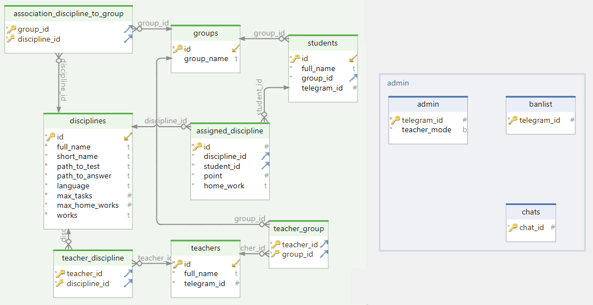
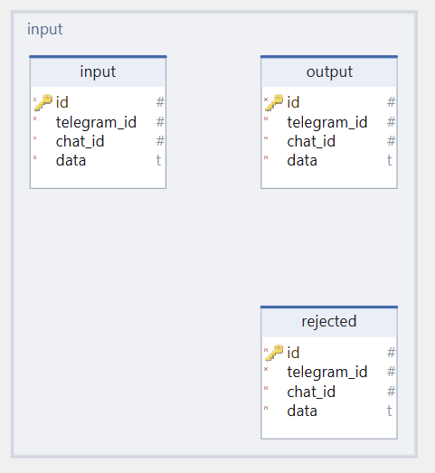
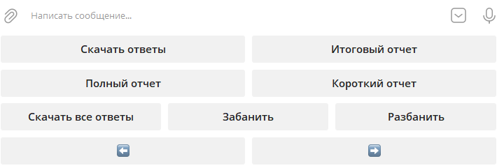
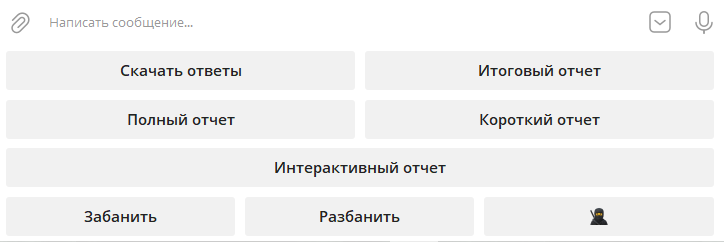
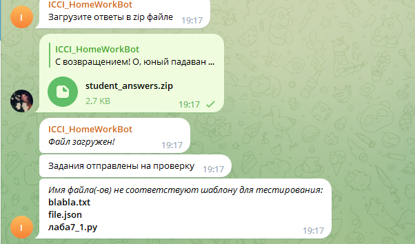

# Описание системы

Программа предназначена для автоматизированной проверки
лабораторных или домашних работ студентов, являющихся участниками определенного телеграм-чата.

При разработке программного средства **HomeworkBot** дополнительно были выполнены следующие задачи: \
1. Реализация Telegram бота с использованием библиотеки Aiogram:3.1.1
2. Примение Docker Volume для получения результатов тестирования из docker-контейнера
3. Миграция СУБД SQLite на PostgreSQL
4. Асинхронная реализация SQLAlchemy 2.0
5. Покрытие кода комментариями


**HomeworkBot** состоит из двух модулей (телеграм-бот
и модуль запуска тестов), запускаемых в отдельных процессах
и взаимодействующих между собой посредством очереди,
организованной с использованием PostgreSQL.

Телеграм-бот поддерживает 3 режима работы:
1. Администратор (имеет возможность добавлять
студентов, преподавателей, группы и дисциплиты в БД,
удалять их, запросить формирование отчетов на любую
из групп, забанить и разбанить студента, загружать предварительно
сформированные тесты для заданий дисциплины,
выгружать весь архив с работами за семестр);
   > Администратор, если он еще преподает дисциплину, может переходить в
режим преподавателя и выполнять действия только над теми группами и студентами,
у которых ведет занятия.
1. Преподаватель  (имеет возможность формировать отчеты
по группам, у которых ведет занятия, выгружать ответы для проверки
банить и снимать бан со студента);
1. Студент (загружает работы, может просматривать свою
успеваемость).
   > **P.S. Студент должен состоять в телеграм-гуппе, идентификатор которой
хранится в базе данных. Иначе он не сможет пройти стадию аутентификации
при запуске телеграм-бота**

Структура базы данных с которой работает программное обеспечение представлена ниже:



Далее приведена структура базы данных, выполнняющей роль очереди
для передачи данных между модулями:



Все загруженные студентам задания в рамках лабораторной или домашней работы
тестируются в докере (Docker), предварительно проходя через ряд фильтров,
позволяющих отсекать нежелательный импорт других модулей или кода, а также
проверяющих отсутствие или обязательное наличие ключевых слов в коде.

> Зависимости системы: SQLAlchemy, SQLAlchemy-Utils, aiohttp, pydantic, asyncpg \
> AIOgram, asyncinit, python-on-whales, openpyxl, python-dotenv

## Стартовая конфигурация системы
Перед запуском любого из модулей системы убедитесь в наличии в
директории с проектом файла ".env", хранящего следующие настройки:

* **PSQL_USER** = postgres
  > имя пользователя в PostgreSQL
* PSQL_PASSWORD = ...
  > пароль пользователя в PostgreSQL
* **PSQL_ADDRESS** = localhost
  > адрес БД PostgreSQL
* **PSQL_PORT** = 5432
  > порт БД PostgreSQL
* **MAIN_DB** = application
  >  имя основной БД
* **QUEUE_DB** = qapp
  > имя промежуточной БД
* **BOT_TOKEN** = 5...w
  > токен телеграм-бота
* **PATH_TO_DISCIPLINES_DATA** = .\...\disciplines_config.json
  > Путь до файла-конфигурации дисциплин. Используется при локальной стартовой
конфигурации основной базы данных, когда у преподавателя назначается 1 группа
* **PATH_TO_INITIALIZATION_DATA** = .\...\teachers_students_data.xlsx
  > Путь до файла-конфигурации с данными преподавателей и студентов. Используется при локальной стартовой
конфигурации основной базы данных, когда у преподавателя назначается 1 группа
* **REMOTE_CONFIGURATION** = True
  > Флаг режима стартовой коннфигурации. Если True, то данные загружаются
админом специальным json-файлом с данными по дисциплинам,
студентам и преподавателям через телеграм-бот, иначе производится локальная конфигурация с
использованием путей из двух верхних параметров
* **DEFAULT_ADMIN** = telegram_id
  > При удаленной конфигурации системы, в момент ее старта данный
идентификатор заносится в БД, назначая администратора, на которого ложится
обязанность выполнить стартовую конфигурацию системы для наполнения базы данных
по преподавателям, группам студентов и дисцилинам
* **TEMP_REPORT_DIR** = temp
  > временная директория, куда будут сохранятся различные отчеты перед
отправкой админу или преподавателю, а также формироваться каталог с файлами
ответов, тестов, конфигурации тестового окружения, которые потом передадутся
в докер для проведения тестирования
* **FLOOD_MIDDLEWARE** = True
  > Флаг подключения флуд-системы, когда студентам запрещается в течение
определенного времени запрашивать отчет по успеваимости и загружать
работы для проверки
* **STUDENT_UPLOAD_LIMIT** = 720
  > лимит в минутах на загрузку ответов
* **STUDENT_COMMAND_LIMIT** = 720
  > лимит в минутах на запрос отчетов
* **AMOUNT_DOKER_RUN** = 3
  > Ограничение на количество работающих docker-контейнеров

## Установка и запуск

Скопируйте репозиторий используя следующую команду:

`git clone https://github.com/YuryRass/HomeworkBot.git`

Затем установите необходимые зависимости из файла requirements.txt:

`pip3 install -r requirements.txt`

Для создания и запуска БД PostgreSQL в docker-контейнере выполните следующую команду:

`docker-compose -f postgresql/docker-compose.yaml up --build`

Для подключения к БД PostgreSQL на host-системе выполните команду:

`sudo -u postgres psql`

> postgres - имя пользователя в PostgreSQL по-умолчанию

После подключения к БД выполните следующие команды для создания баз данных:

* `create database <MAIN_DB>;`
* `create database <QUEUE_DB>;`

Создайте и заполните `.env` файл. \
Если будете запускать БД в docker контейнере, то переменной **PSQL_PORT** присвойте значение **HOST_PORT**, взятое из файла `./postgresql/.env`.
Если вы планируете удаленную конфигурацию,
то установите флаг **REMOTE_CONFIGURATION** в True, иначе убедитесь, что
созданы необходимые файлы для первого запуска системы с локальной конфигурацией.
Если у вас не слишком производительное оборудование, то для запуска системы
используйте следующую команду, предварительно установив параметр **_AMOUNT_DOKER_RUN = 1_**:

`python run_system_in_one_process.py`

Для запуска каждой подсистемы как отдельного процесса откройте два терминала, в
каждый из которых введите по одной из следующих команд:

`python run_bot.py`

`python run_test_checker.py`

## Режим администратора и структура конфигурационных файлов
Администратору доступно 3 экрана меню, между которыми можно переключаться,
используя кнопки ➡ и ⬅. Для перехода в режим преподавателя,
необходимо нажать на кнопку со следующим эмоджи 👨‍🏫
  > Кнопка переключения между режимами доступна, когда администратор значится
  > одним из преподавателей. Для того, чтобы вернуться обратно к администрированию,
  > нажмите на кнопку 👤

Первый экран меню, который встречает админа, выглядит следующим образом:


Практически все команды первого экрана имеют последовательную структуру.
Наибольший интерес здесь представляют 2 команды, которые подразумевают
загрузку json-файла определенной структуры:
* **Добавить дисциплину**
  > ```json
  > {
  >   "full_name": "Технологии и методы программирования",
  >   "short_name": "ТМП-2",
  >   "path_to_test": "_disciplines/tmp2/test",
  >   "path_to_answer": "_disciplines/tmp2/answer",
  >   "language": "python",
  >   "works": [
  >     {
  >       "number": 1,
  >       "amount_tasks": 11,
  >       "deadline": "2022-02-01"
  >     },
  >     {
  >       "number": 2,
  >       "amount_tasks": 20,
  >       "deadline": "2022-02-01"
  >     },
  >     ...
  >     {
  >       "number": 10,
  >       "amount_tasks": 10,
  >       "deadline": "2022-02-01"
  >     }
  >   ]
  > }
* **Добавить гр.студентов**
  > ```json
  > [
  >   {
  >     "group_name": "Z4831",
  >     "disciplines_short_name": [
  >       "ТМП",
  >       "ТМП-2"
  >     ],
  >     "students": [
  >       "Аксенов Иван Валерьевич",
  >        ...
  >       "Варданян Алена Рачьяевна"
  >     ]
  >   },
  >   ...
  >   {
  >     "group_name": "Z4832",
  >     "disciplines_short_name": [
  >       "ТМП"
  >     ],
  >     "students": [
  >       "Горохов Иван Сергеевич",
  >       ...
  >       "Карелина Алена Владимировна"
  >     ]
  >   }
  > ]

Второй экран меню содержит команды на формирование отчетов, а также
команду "Забанить" и "Разбанить":



Команда **"Скачать все ответы"** выкачивает полностью директорию с дисциплинами,
содержащую все загруженные ответы студентов для проверки. А команда **"Скачать ответы"**
выкачивает только ответы конкретной группы.
Команды **"Итоговый отчет"**, **"Полный отчет"**, **"Финальный отчет"**
запускают формирование отчета кокретного вида в excel-формате и
отправляет его в чат для скачивания.
Команды на третьем экране меню позволяют удалять студентов, группы и преподавателей,
а также проводить стартовую конфигурацию системы, загружая информацию
для заполнения базы данных и архив с тестами для указываемой дисциплины:


Стартовая конфигурация должна иметь следующий вид:
```json
{
  "chats": [
    -658999999
  ],
  "groups": [
    {
      "group_name": "Z4831",
      "disciplines_short_name": [
        "ТМП",
        "ТМП-2"
      ],
      "students": [
        "Аксенов Иван Валерьевич",
        ...
        "Варданян Алена Рачьяевна"
      ]
    },
    ...
    {
      "group_name": "Z4832",
      "disciplines_short_name": [
        "ТМП"
      ],
      "students": [
        "Горохов Иван Сергеевич",
        ...
        "Карелина Алена Владимировна"
      ]
    }
  ],
  "teachers": [
    {
      "full_name": "Иванов Иван Иванович",
      "telegram_id": 1166999999,
      "assign_disciplines": [
        "ТМП",
        "ТМП-2"
      ],
      "assign_groups": [
        "Z4832",
        "Z4831"
      ],
      "is_admin": true
    },
    {
      "full_name": "Иванов Владислав Андреевич",
      "telegram_id": 1166999995,
      "assign_disciplines": [
        "ТМП"
      ],
      "assign_groups": [
        "Z4832"
      ],
      "is_admin": true
    }
  ],
  "disciplines": [
    {
      "full_name": "Технологии и методы программирования",
      "short_name": "ТМП",
      "path_to_test": "_disciplines/tmp/test",
      "path_to_answer": "_disciplines/tmp/answer",
      "language": "python",
      "works": [
        {
          "number": 1,
          "amount_tasks": 11,
          "deadline": "2022-02-01"
        },
        {
          "number": 2,
          "amount_tasks": 20,
          "deadline": "2022-02-01"
        },
        ...
        {
          "number": 10,
          "amount_tasks": 10,
          "deadline": "2022-02-01"
        }
      ]
    },
    {
      "full_name": "Технологии и методы программирования",
      "short_name": "ТМП-2",
      "path_to_test": "_disciplines/tmp2/test",
      "path_to_answer": "_disciplines/tmp2/answer",
      "language": "python",
      "works": [
        {
          "number": 1,
          "amount_tasks": 11,
          "deadline": "2022-02-01"
        },
        {
          "number": 2,
          "amount_tasks": 20,
          "deadline": "2022-02-01"
        },
        ...
        {
          "number": 10,
          "amount_tasks": 10,
          "deadline": "2022-02-01"
        }
      ]
    }
  ]
}
```

## Режим преподавателя
Меню преподавателя напоминает собой второй экран администратора с тем отличием,
что работать он может только в рамках назначенных ему групп для преподавания:



> Команда **"Интерактивный отчет"** формирует отчет не за всю группу, а
> по конкретному студенту, выводя его в чат в виде сообщения

## Режим студента
У студента доступны всего 3 команды. Одна для загрузки домашней или лабораторной
работы, другие две - информационные, позволяющие ему узнать текущую успеваемость
и самый ближайший дедлайн по выбранной дисциплине:


> Если часть отправленных файлов не проходят на тестирование, студент оповещается
> об этом, как показано на рисунке ниже.



# Требования к тестам

## Конфигурация тестового окружения
Архив с тестами к дисциплине должен иметь следующую структуру:


В пронумерованных директориях, обозначающих номер лабораторной или
домашней работы содержатся тесты к заданиям. Обязательным требованием к
каждой из директорий архива, содержащей тесты является наличие файла
**_"settings.json"_**:


Файл **_"settings.json"_** содержит информацию о дополнительных зависимостях,
которые необходимо установить при разворачивании docker-контейнера. Глобальный
запрет (**global_level**) на ряд ключевых слов (например **"eval"**) и данные по ключевым словам,
которые обязательно должны присутствовать в решении конкретного задания (**local_level**).
Дополнительно к этому имеется возможность разрешать импортировать некоторые модули
(по умолчанию это запрещено).
Ниже приведен пример заполнения такого файла. У каждой работы он будет
уникальный:
```json
{
    "dependencies": [
      "SQLAlchemy",
      "python-dotenv"
    ],
    "global_level": {
        "prohibition": [
            "for",
            "eval",
            "while"
        ],
        "restriction": null
    },
    "local_level": [
        {
            "lab_number": 1,
            "resolve_import": null,
            "prohibition": null,
            "restriction": [
                "in"
            ]
        },
        {
            "lab_number": 2,
            "resolve_import": [
                "reports"
            ],
            "prohibition": null,
            "restriction": [
                "len"
            ]
        },
        {
            "lab_number": 3,
            "resolve_import": null,
            "prohibition": null,
            "restriction": [
                ".count"
            ]
        },
        ...
        {
            "lab_number": 6,
            "resolve_import": null,
            "prohibition": null,
            "restriction": [
                ":",
                "\\+"
            ]
        },
        ...
        {
            "lab_number": 11,
            "resolve_import": null,
            "prohibition": null,
            "restriction": [
                ".split"
            ]
        }
    ]
}
```
> Поле **dependencies** устанавлиется в null, если у тестов нет никаких внешних зависимостей

> **global_level** задает ограничения (_prohibition_) или
> требования (_restriction_) у наличию ключевых слов сразу ко всем файлам.
> Если какой-либо из загруженных студентом ответов содержит запрещенные ключевые слова, то этот файл убирается из тестирования.

> **local_level** позволяет проводить более тонкую настройку политик проверок, перед запуском тестирования.
> Так, например, посредством поля _resolve_import_ можно разрешить импорт конкретных модулей в ответе студента,
> используя _prohibition_ запретить еще ряд ключевых слов для конкретного варианта ответа. А использя
> поле _restriction_ убедиться, что студент для решения задачи использует необходимые ключевые слова
> (если нет - ответ убирается из списка тестируемых)

## Оформление теста на задание
Результат каждого теста необходимо записывать в специализированный логгер,
который как и ответы с тестовым окружением копируется в запускаемый docker-контейнер.
Иначе не получится вернуть результат тестирования, что будет достаточно печально для студентов ;)
Ниже приведен пример оформленного тестового окружения к одному из заданий домашней (лагораторной) работы:
```python
# test_lab1_3.py
import lab1_3


task = 3


def test_lab1_3_1(capsys, logger):
    str1 = "Цель работы: познакомиться с основны-ми"

    try:
        lab1_3.app(str1)
        captured = capsys.readouterr()
        assert captured.out == "5\n"
        logger.add_successful_task(task)
    except AssertionError as aerr:
        logger.add_fail_task(task, 'Неверный подсчет количества вхождений')
    except Exception as ex:
        logger.add_fail_task(task, 'Что-то пошло не так... Оо')


def test_lab1_3_2(capsys, logger):
    str1 = "ооо"

    try:
        lab1_3.app(str1)
        captured = capsys.readouterr()
        assert captured.out == "3\n"
        logger.add_successful_task(task)
    except AssertionError as aerr:
        logger.add_fail_task(task, 'Неверный подсчет количества вхождений')
    except Exception as ex:
        logger.add_fail_task(task, 'Что-то пошло не так... Оо')
